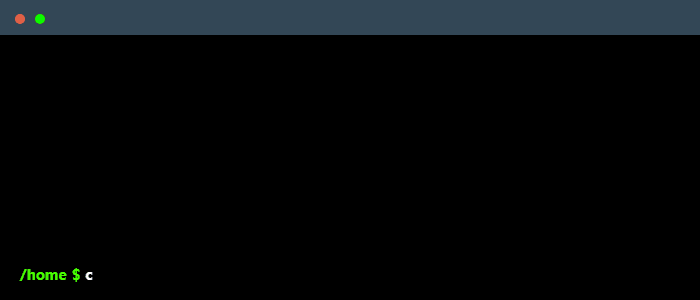

<!--
    Hey there, I'm nopedal!
    Happy to see you here exploring my README code
    Feel free to inspire!
    
    But may I please ask you to follow me in return? Just a click!
-->

 

<!--
    Your own Terminal GIF can be created here -> https://www.terminalgif.com
-->

    

<!--
     This is the list of my skills and tools I am studying!
-->
### Main skills

### Studying

<!--
     Fast links to my socials!
-->

### Connect with me!

    
    
    
    

<!--
     Thanks for being my guest <3
-->
